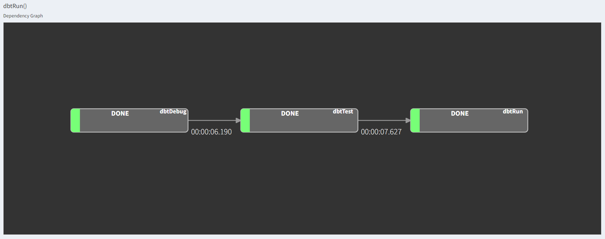

# **dbt + Luigi**
---

- Pada repository ini akan menggabungkan dbt dengan Luigi
- Fungsi dari Luigi adalah melakukan Orchestration terhadap Transformation atau ELT Pipeline yang dibuat
- Sehingga, bisa melakukan proses scheduling dan mengatur flow dari dbt
- Task dbt yang akan dilakukan proses orchestration adalah
    - `dbt debug`: Mengecek koneksi antara dbt dengan data source
    - `dbt deps`: Menginstall dependensi yang dibutuhkan
    - `dbt test`: Melakukan proses testing terhadap data model yang dimiliki dan membuat table constraints
    - `dbt run`: Menjalankan data model yang sudah dibuat

- Pada repo ini, kita akan menggunakan case data source [Mini Order](https://github.com/ihdarsyd/mini-order/)
- Untuk dbt data model, kita akan mengggunakan referensi dari repository https://github.com/shandytepe/mini_order_dbt/
   
### **dbt + Luigi Visualizer**
---

### **Explanation**
---

- Dikarenakan Luigi hanya bisa berjalan jika ada input dan output, maka kita harus mengakali dengan produce log file
- Agar bisa berjalan terus proses Luigi, maka pada log file yang dibuat akan diberikan timestamp yang berasal dari parameter `GlobalParams().CurrentTimestampParams`
- Untuk menjalankan proses dbt + Luigi, kita bisa menjalankan shell script `./run_dbt.sh`
- Sebelum itu, ubah permissions shell script `run_dbt.sh` dengan cara `chmod 755 run_dbt.sh`
- Selain itu, kita juga bisa melakukan scheduling terhadap script yang sudah dibuat

### **Tools**
---

1. Python
2. Luigi
3. dbt
4. SQL
5. Postgres
6. DBeaver
7. Docker